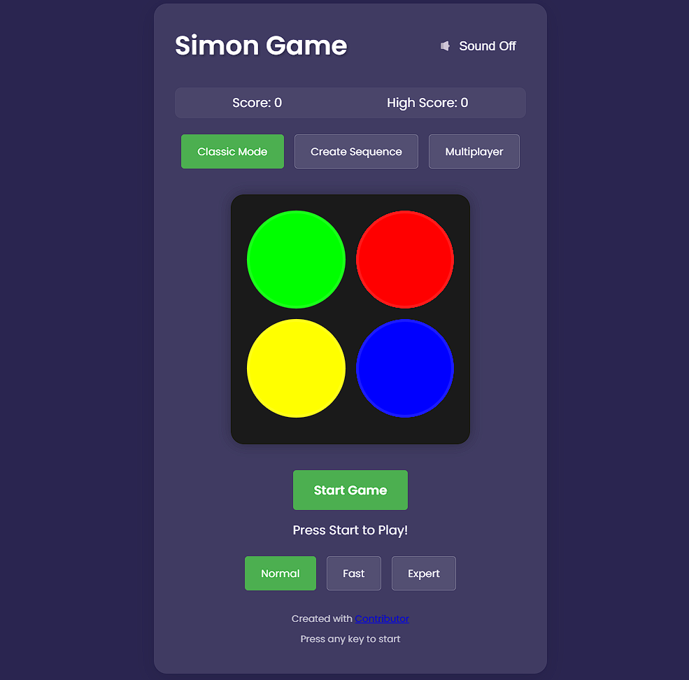
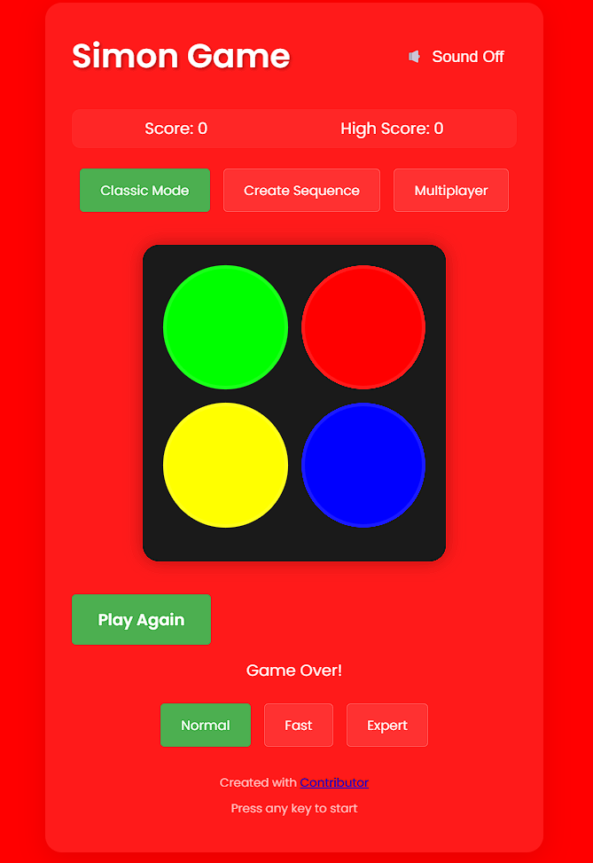

# Simon Game

A modern implementation of the classic Simon memory game with multiple game modes, difficulty levels, and a professional UI.

## Features

- 🎮 Multiple game modes (Classic, Create Sequence, Multiplayer)
- ⚙️ Three difficulty levels (Normal, Fast, Expert)
- 🎵 Sound effects with toggle functionality
- 📊 High score tracking
- 📱 Responsive design for all devices
- 🎨 Modern UI with smooth animations
- 🎯 Create and share custom sequences
- 👥 Two-player competitive mode

## Screenshots

### Game Interface


### Game Modes



## Installation

1. Clone the repository:
```bash
git clone https://github.com/yourusername/simon-game.git
```

2. Install dependencies:
```bash
npm install
```

3. Start the development server:
```bash
npm start
```

4. Open `http://localhost:3000` in your browser

## How to Play

1. Press any key to start the game
2. Watch and remember the sequence of colors
3. Repeat the sequence by clicking the buttons in the same order
4. Each successful round adds a new color to the sequence
5. Make a mistake and the game ends

### Game Modes

- **Classic Mode**: Traditional Simon gameplay
- **Create Sequence**: Create and share your own patterns
- **Multiplayer**: Two-player competitive mode

### Difficulty Levels

- **Normal**: Standard game speed
- **Fast**: Increased sequence speed
- **Expert**: Maximum speed with shorter display time

## Technologies Used

- HTML5
- CSS3
- JavaScript (ES6+)
- Web Audio API
- LocalStorage API

## Browser Support

- Chrome (latest)
- Firefox (latest)
- Safari (latest)
- Edge (latest)

## Contributing

Contributions are welcome! Please feel free to submit a Pull Request.

## License

This project is licensed under the MIT License - see the [LICENSE](LICENSE) file for details.

## Acknowledgments

- Inspired by the original Simon electronic game
- Built with vanilla JavaScript for optimal performance
- Uses Web Audio API for sound implementation
- Font: Poppins from Google Fonts

## Author

Created with ❤️

@ Subhranshu sekhar choudhury.

